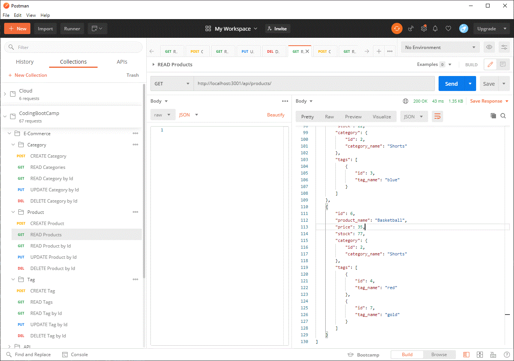

# E-CommerceBackEnd


## Description

An E-Commerce website back end.


## Table of Contents 

* [Installation](#Installation)

* [Usage](#Usage)

* [License](#License)

* [Repository](#Repository)

* [Questions](#Questions)


## Installation:

Run the following command:

```bash
npm i
```


## Usage

Run the command: `npm start`.  This will expose all the API endpoionts to be consumed by various clients.


Please find walkthrough demonstation of how to use this app at: [https://drive.google.com/file/d/1vuP9tkWGjj8e1PXoe90SoPgOF7CadrOU/view](https://drive.google.com/file/d/1vuP9tkWGjj8e1PXoe90SoPgOF7CadrOU/view).





## License:

This app is licensed under the MIT license.


## Repository:

[https://github.com/jrdrenth/E-CommerceBackEnd](https://github.com/jrdrenth/E-CommerceBackEnd)


## Questions:

If you have any questions, please contact me at john.drenth@gmail.com.  My github profile can be found at [https://github.com/jrdrenth/](https://github.com/jrdrenth/).

